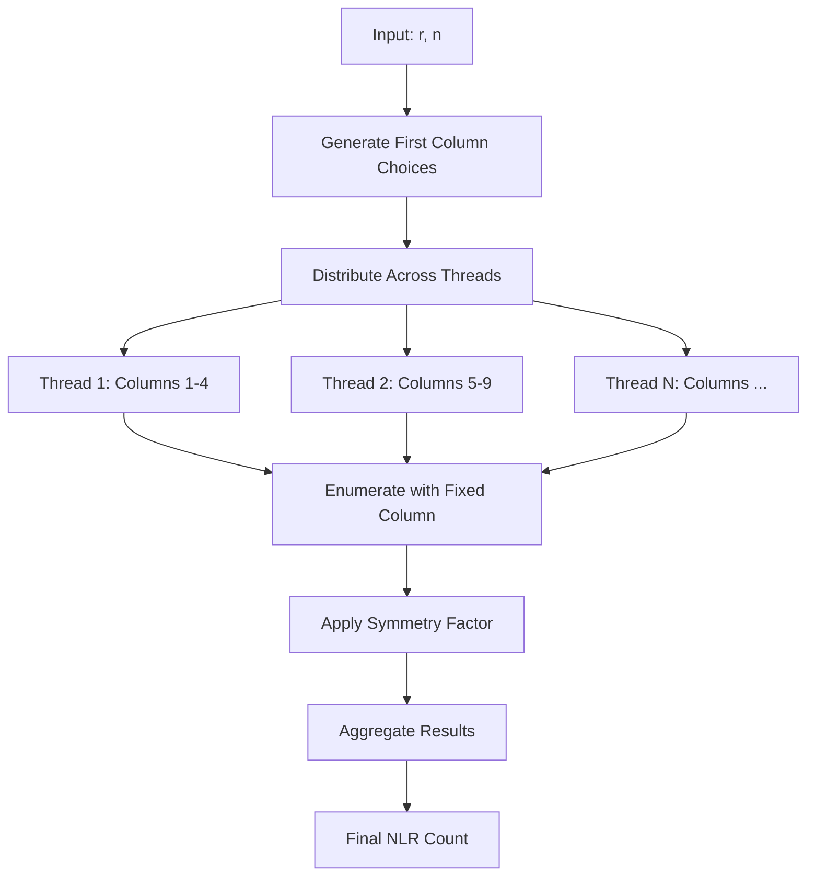

# Design Document

## Overview

The first column optimization transforms Latin rectangle enumeration from a second-row-based parallelization strategy to a first-column-based approach. By fixing the first column and exploiting the (r-1)! symmetry, we achieve better work distribution and enhanced constraint propagation.

## Architecture

### High-Level Design



### Core Components

1. **FirstColumnEnumerator**: Generates all valid first column configurations
2. **WorkDistributor**: Assigns column choices to threads
3. **ConstrainedEnumerator**: Enumerates rectangles with fixed first columns
4. **SymmetryCalculator**: Applies (r-1)! factor to counts
5. **ResultAggregator**: Combines results from all threads

## Components and Interfaces

### FirstColumnEnumerator

```python
class FirstColumnEnumerator:
    def enumerate_first_columns(self, r: int, n: int) -> List[List[int]]:
        """Generate all valid first column configurations.
        
        Args:
            r: Number of rows
            n: Number of columns
            
        Returns:
            List of first column configurations, each as [1, a, b, c, ...]
            where a,b,c are chosen from {2,3,...,n}
        """
        
    def count_first_columns(self, r: int, n: int) -> int:
        """Count total number of first column configurations.
        
        Returns: C(n-1, r-1) combinations
        """
```

### WorkDistributor

```python
class WorkDistributor:
    def distribute_work(self, column_choices: List[List[int]], 
                       num_threads: int) -> List[List[List[int]]]:
        """Distribute first column choices across threads.
        
        Args:
            column_choices: All first column configurations
            num_threads: Number of available threads
            
        Returns:
            List of work assignments, one per thread
        """
```

### ConstrainedEnumerator

```python
class ConstrainedEnumerator:
    def enumerate_with_fixed_first_column(self, r: int, n: int, 
                                        first_column: List[int]) -> Tuple[int, int]:
        """Enumerate rectangles with fixed first column.
        
        Args:
            r: Number of rows
            n: Number of columns  
            first_column: Fixed first column values
            
        Returns:
            Tuple of (positive_count, negative_count)
        """
        
    def filter_derangements(self, derangements: List[Tuple], 
                          first_column: List[int]) -> List[Tuple]:
        """Filter derangements compatible with first column.
        
        Args:
            derangements: All second row derangements
            first_column: Fixed first column values
            
        Returns:
            Filtered derangements that don't conflict with first column
        """
```

### Enhanced Constraint System

```python
class EnhancedConstraintPropagator:
    def create_first_column_masks(self, first_column: List[int], 
                                n: int) -> List[int]:
        """Create bitwise masks for first column constraints.
        
        Args:
            first_column: Fixed first column values
            n: Number of columns
            
        Returns:
            List of constraint masks, one per row
        """
        
    def update_position_value_constraints(self, constraints: Dict, 
                                        first_column: List[int]) -> Dict:
        """Update position-value constraints for fixed first column.
        
        Args:
            constraints: Current constraint dictionary
            first_column: Fixed first column values
            
        Returns:
            Updated constraints with first column applied
        """
```

## Data Models

### FirstColumnChoice

```python
@dataclass
class FirstColumnChoice:
    values: List[int]  # [1, a, b, c, ...] where a,b,c from {2,...,n}
    row_positions: List[int]  # [0, 1, 2, 3, ...] (always sequential)
    
    def __post_init__(self):
        assert self.values[0] == 1  # First element must be 1
        assert len(set(self.values)) == len(self.values)  # No duplicates
```

### WorkUnit

```python
@dataclass  
class WorkUnit:
    thread_id: int
    first_column_choices: List[FirstColumnChoice]
    positive_count: int = 0
    negative_count: int = 0
    
    def add_result(self, positive: int, negative: int, symmetry_factor: int):
        """Add results from one first column choice."""
        self.positive_count += positive * symmetry_factor
        self.negative_count += negative * symmetry_factor
```

### OptimizationResult

```python
@dataclass
class OptimizationResult:
    total_positive: int
    total_negative: int
    difference: int
    processing_time: float
    rectangles_per_second: float
    first_columns_processed: int
    symmetry_factor: int
    
    @property
    def speedup_factor(self) -> float:
        """Calculate speedup vs baseline."""
        return self.rectangles_per_second / self.baseline_rate
```

## Correctness Properties

*A property is a characteristic or behavior that should hold true across all valid executions of a system-essentially, a formal statement about what the system should do. Properties serve as the bridge between human-readable specifications and machine-verifiable correctness guarantees.*

### Property 1: First Column Generation Completeness
*For any* valid dimensions (r,n) with r≥3, the first column enumerator should generate exactly C(n-1, r-1) distinct column configurations, each starting with 1 and containing no duplicate values.
**Validates: Requirements 1.1, 1.2, 1.4**

### Property 2: Work Distribution Balance  
*For any* set of first column choices and thread count, the work distributor should assign choices such that no thread receives more than ⌈total_choices/thread_count⌉ work units.
**Validates: Requirements 2.1, 2.2, 2.3**

### Property 3: Constraint Propagation Correctness
*For any* first column choice and rectangle enumeration, applying first column constraints should produce a subset of rectangles that would be generated without constraints, and all generated rectangles should satisfy the first column values.
**Validates: Requirements 3.1, 3.2, 3.3**

### Property 4: Symmetry Factor Preservation
*For any* rectangle count (positive, negative) and symmetry factor k, applying the symmetry factor should preserve the sign of the difference: sign(positive-negative) = sign(k*positive - k*negative).
**Validates: Requirements 4.1, 4.2, 4.4**

### Property 5: Derangement Filtering Correctness
*For any* first column choice and derangement set, the filtered derangements should exclude exactly those derangements whose first element appears in positions 2 through r of the first column.
**Validates: Requirements 5.1, 5.2, 5.3**

### Property 6: Result Equivalence
*For any* valid dimensions (r,n), the optimized algorithm should produce identical positive count, negative count, and difference as the current algorithm.
**Validates: Requirements 7.1, 7.2, 8.3**

### Property 7: Memory Efficiency Bound
*For any* computation using the optimized algorithm, peak memory usage should not exceed 110% of the current algorithm's memory usage for the same problem dimensions.
**Validates: Requirements 10.3**

### Property 8: Performance Improvement
*For any* computation on dimensions (r,n) with r≥3, the optimized algorithm should achieve at least 1.5x the rectangles-per-second rate of the current algorithm.
**Validates: Requirements 6.6, 9.4**

## Error Handling

### Input Validation
- Validate r ≥ 3 (first column optimization only applies to r≥3)
- Validate n > r (standard Latin rectangle constraint)
- Validate thread count > 0 and ≤ available CPU cores

### Constraint Conflicts
- Detect impossible first column configurations (shouldn't occur with valid generation)
- Handle empty derangement sets after filtering (indicates algorithmic error)
- Validate constraint mask consistency before enumeration

### Memory Management
- Monitor memory usage during enumeration
- Implement graceful degradation if memory limits approached
- Clean up work unit data structures after completion

### Thread Safety
- Ensure thread-safe result aggregation
- Prevent race conditions in shared constraint data
- Handle thread failures gracefully with partial results

## Testing Strategy

### Unit Testing
- Test first column generation for various (r,n) combinations
- Test work distribution algorithms with different thread counts
- Test derangement filtering with known first column choices
- Test symmetry factor calculations
- Test constraint mask generation and application

### Property-Based Testing
- Generate random valid dimensions and verify all properties hold
- Test with random first column choices and verify constraint correctness
- Stress test work distribution with various thread configurations
- Validate memory usage bounds across different problem sizes

### Integration Testing
- Compare results with current algorithm on small dimensions (3,4), (3,5), (4,6)
- Performance benchmarking on medium dimensions (4,7), (5,7)
- Memory usage validation across all test dimensions
- Thread safety testing with concurrent execution

### Performance Testing
- Measure rectangles-per-second improvement
- Profile constraint propagation efficiency
- Benchmark memory usage vs current algorithm
- Validate speedup claims on target dimensions

Each property test should run minimum 100 iterations and be tagged with:
**Feature: first-column-optimization, Property N: [property description]**